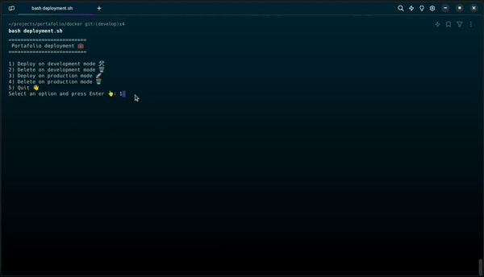

<a href="README.md">
  
</a>

# 💼 Portafolio Web 📱
<div>
  <a href="https://docs.docker.com/compose/" target="_blank">
    
  </a>
  <a href="https://nginx.org/en/docs/" target="_blank">
    
  </a>
  <a href="https://nodejs.org/en/" target="_blank">
    
  </a>
</div>

### Requisitos previos 📝
- Docker Compose **versión 2.x**
- Ejecutar bash desde la carpeta **docker**

#### Puertos habilitados
- [**3000**](http://localhost:3000) para desarrollo
- [**4000**](http://localhost:4000) para producción


#### Menu de acciones disponibles
```bash
$ bash deployment.sh
```
```bash
=========================
 Portafolio deployment 💼
=========================
1) Deploy on development mode 🛠
2) Delete on development mode 🗑️
3) Deploy on production mode 🚀
4) Delete on production mode 🗑️
5) Quit 👋
Select an option and press Enter 👆: 
```

### Demo 🎬



## Información relevante 📑
### Imagen
```bash
$ docker images
```
| REPOSITORY      | TAG                | SIZE   |
| --------------- | ------------------ | ------ |
| node            | 18.14.2-alpine3.17 | ~174MB |
| portafolio      | 1.0.0              | ~41MB  |

### Contenedor
| NAME            | PORTS                  |
| --------------- | ---------------------- |
| portafolio      | 0.0.0.0:3000->5173/tcp |
| portafolio-prod | 0.0.0.0:4000->80/tcp   |
