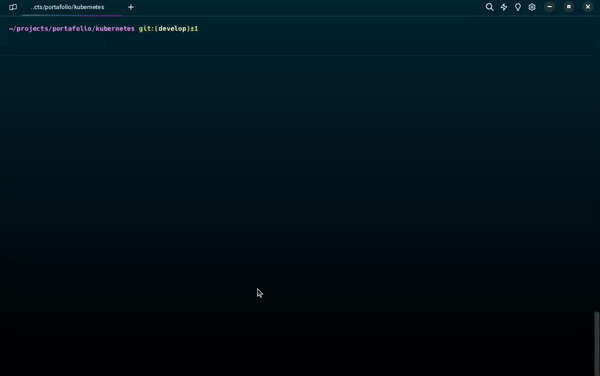

<a href="README.md">
  
</a>

# 💼 Portafolio Web 📱

### Requisitos previos 📝
- [**Microk8s**](https://microk8s.io/docs/getting-started)
- Ejecutar bash desde la carpeta **kubernetes**

#### Puerto habilitado
- [**30000**](http://localhost:30000)

#### Menu de opciones 📋
```bash
$ bash deployment.sh
```
```bash
=========================
 Portafolio deployment 💼
=========================
1) Deploy service 🚀
2) Delete service 🗑️
3) Port forward website 🌐
5) Quit 👋
Select an option and press Enter 👆: 
```

### Demo 🎬


## Información relevante 📑
### Deployment
```bash
$ kubectl get deployment -n web
```
| NAME       | IMAGES                      |
| ---------- | --------------------------- |
| portafolio | bgmolina/portafolio:testing |

### Service
```bash
$ kubectl get services -n web
```
| NAME           | TYPE     | PORT(S)      |
| -------------- | -------- | ------------ |
| portafolio-svc | NodePort | 80:30000/TCP |
