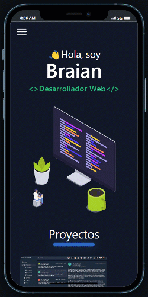
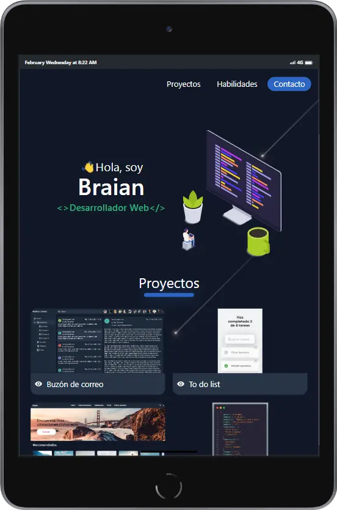
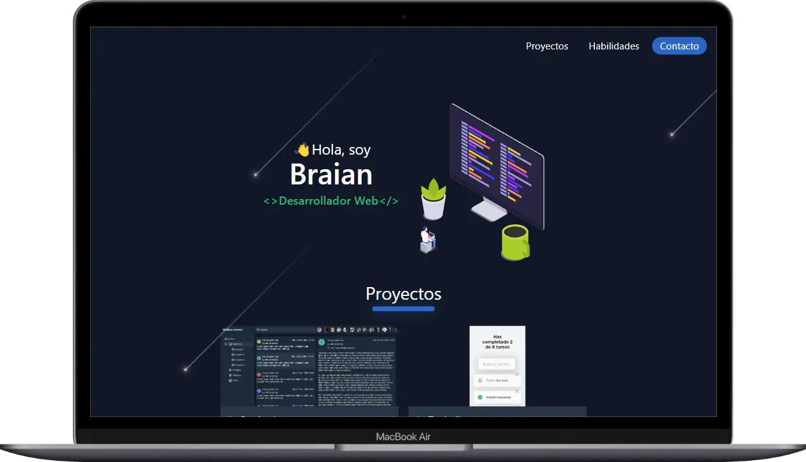

# 💼 Portafolio Web 📱

  
  
  
  
  
  

## Interfaz de usuario (UI) 
Desarrollado en figma bajo diseño atomico:  
🌐 Proyecto: 👉 [`URL`](https://www.figma.com/community/file/1202589711092010403)
📱 Prototipo Mobile: 👉 [`URL`](https://www.figma.com/proto/npBr1CTsA8zQma2iwPEzA6/Portafolio?node-id=117%3A988&scaling=scale-down&page-id=46%3A522&starting-point-node-id=117%3A988)
💻 Prototipo Desktop: 👉 [`URL`](https://www.figma.com/proto/npBr1CTsA8zQma2iwPEzA6/Portafolio?node-id=161%3A2421&scaling=scale-down&page-id=150%3A1867&starting-point-node-id=161%3A2421)

## Link proyecto 🌐
👉 [`URL`](https://bmolina1993.github.io/portafolio/)

### Demo 🎬
  
  
  
